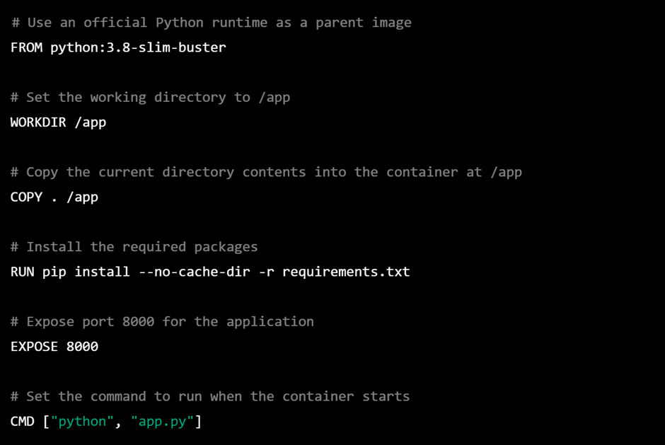

# Containers
 
## What’s Containerization?

Containerization is a method of software development and deployment that enables applications to be isolated from the underlying operating system and hardware infrastructure, while still being able to run efficiently and consistently across different computing environments.

Containers are lightweight, standalone software packages that contain everything an application needs to run, including code, runtime, system tools, libraries, and settings. They are created by bundling an application with its dependencies and packaging them into a single unit, which can be easily moved from one computing environment to another.

The main benefits of containerization include:
- Portability: Containers can run on any platform that supports containerization, making it easy to move applications from one environment to another.
- Consistency: Containers provide a consistent runtime environment for applications, ensuring that they run the same way regardless of the underlying infrastructure.
- Efficiency: Containers are lightweight and consume minimal resources, allowing applications to run more efficiently and with greater scalability.
- Isolation: Containers provide a level of isolation between applications, which reduces the risk of conflicts and improves security.

Containerization has become increasingly popular in recent years, especially with the rise of cloud computing and DevOps practices. Popular containerization technologies include Docker and Kubernetes.

## Core Docker Concepts

Dockerfile, image, and container are all core concepts of the Docker platform:

1.	*Dockerfile*: A Dockerfile is a text file that contains a series of instructions for building a Docker image. It specifies the base image, application dependencies, and configuration settings needed to create an image.
2.	*Docker image*: A Docker image is a standalone package that includes everything needed to run an application, including code, runtime, system tools, libraries, and settings. It is created by building a Dockerfile using the docker build command.
3.	*Docker container*: A Docker container is a running instance of a Docker image. It is created by running the docker run command, which starts a new container based on a specific image. A container is a lightweight and portable executable package that can run anywhere, from a developer's laptop to a production environment.

The Dockerfile is used to **build** a Docker image, which can then be used to create multiple Docker containers. Each container is an isolated environment that runs a specific instance of an application. Containers can be started, stopped, and restarted independently of each other, allowing for efficient resource utilization and dynamic scaling.

In summary, the Dockerfile defines the instructions for building a Docker image, which can then be used to create multiple Docker containers. Each container is a standalone and isolated instance of an application that can run anywhere.

## Overview of Docker in 100 seconds

https://www.youtube.com/watch?v=Gjnup-PuquQ

## Creating a Dockerfile

To create a Dockerfile, you can use any text editor to create a new file named `Dockerfile` and then add a series of instructions to it. 

As an example, here's what a `Dockerfile` looks like to build a simple container running a Python application:

This Dockerfile starts with a `FROM` instruction, which specifies the base image to use. In this case, we're using the official Python 3.8 slim image.

The `WORKDIR` instruction sets the working directory inside the container to `/app`.

The `COPY` instruction copies the contents of the current directory into the container at `/app`.

The `RUN` instruction installs the required Python packages by running `pip install` with the contents of `requirements.txt`.

The `EXPOSE` instruction exposes port 8000 for the application.

Finally, the `CMD` instruction specifies the command to run when the container starts, which in this case is `python app.py`.

Once you have created the Dockerfile, you can use the docker build command to build an image from it. For example, if the Dockerfile is in the current directory, you can run the following command:

 
This command builds an image with the tag my-python-app from the current directory (.), using the instructions in the Dockerfile. You can then use the docker run command to start a container from the image:

 
This command starts a new container from the my-python-app image and maps port 8000 from the container to port 8000 on the host machine.

---

Okay, now we've got that covered, it's time to start building our own containers!

[>> Setup](resources/0.%20Before%20you%20start.MD)