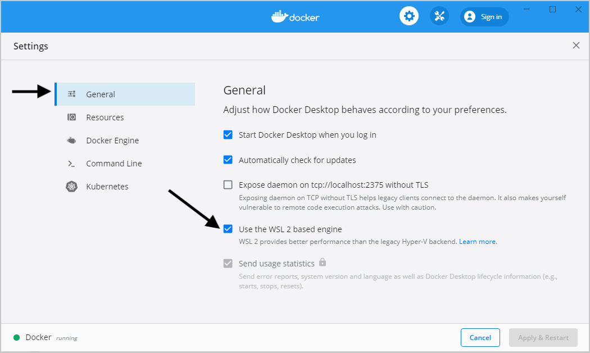
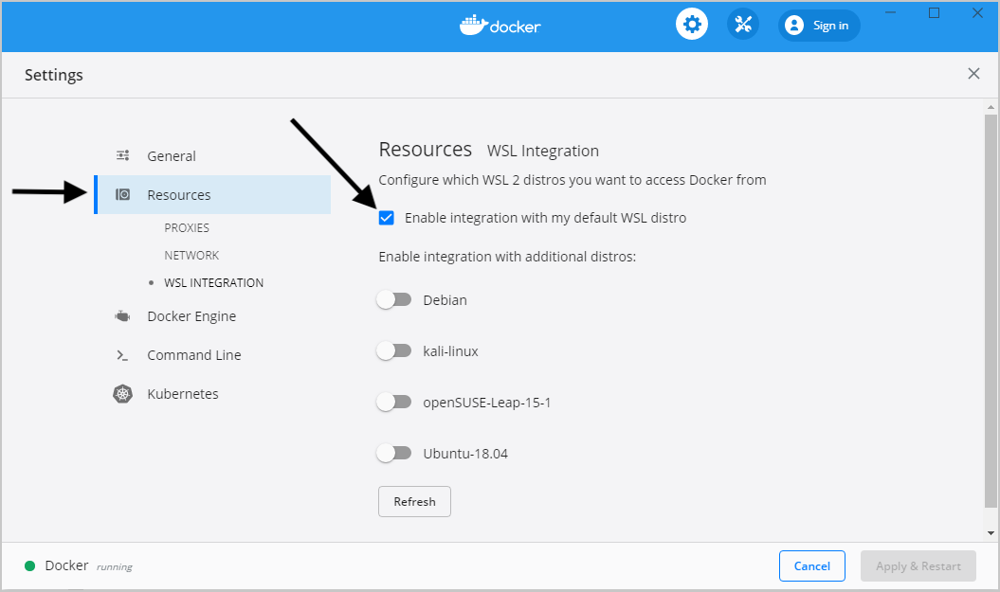

# Before you start

## Install Docker Desktop

https://docs.docker.com/desktop/install/windows-install/

## Docker License

**You must have a valid licence to use Docker Desktop in enterprise environments!** We are using docker for educational purposes - you should remove it once finished.

## WSL integration

You should have [enabled WSL if you are on a Windows machine](https://github.com/bjssacademy/wsl).

Please make sure that you have enabled WSL integration in Docker Desktop as per the following screenshots:

**Docker Desktop is updated all the time so screenshots may vary over time; yours may not look exactly like this**

Make sure that you are using the WSL2 engine:

Ensure that you have enabled integration:

_In some configurations, where you have other WSL distros than a single default, you may also have to select the corresponding distro from the sliders on the page_

## Using Powershell?
Though you can run _most_ exercises using Powershell if on Windows, you might want to stick to WSL as some of the instructions make use of Unix/Linux shell tools that may not be available in Powershell, and you may not be able to follow the guides without substituting some of the commands.

> WSL is a virtualisation of a Linux environment. By default we have installed Ubuntu. Search for this on your Windows system and open the terminal to start "using WSL".

---

[>> Docker basics](./1.%20Docker%20Basics.MD)