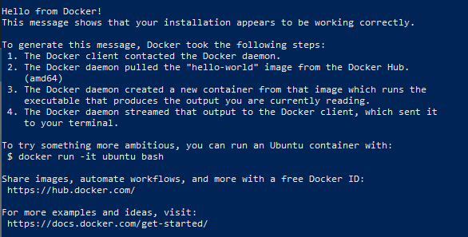
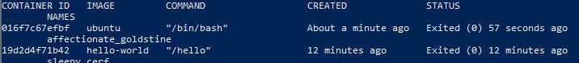
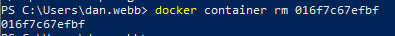
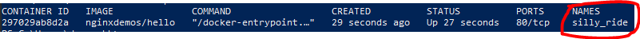

[[_TOC_]]
# Using Docker

## Pulling Images
---
To show all of the images you have locally run the following command:

```bash
docker images
```

Now pull a simple a demo image from docker hub:

```bash
docker pull hello-world
```

## Running The image
---
We can start a container with this image using **run**:

```bash
docker run hello-world
```



## Running Something More Interesting
---
That wasn't very interesting. Lets Pull the Ubuntu Image for docker:

```bash
docker run ubuntu
```

Note: We don't need to pull the image first, docker does this for us before running the image.

**What happened?**

**A.** The container ran then immediately exited.

**Why?**

Docker images have something known as an *entry point*. The entry point is the command that the container executes when it starts. When the command or process that the container runs exits so does the container.

### Specifying an Entrypoint
---
We can tell docker what command to run by specifying an entrypoint on the command line:

```bash
docker run --entrypoint date ubuntu
```

The container will print the current date and time then exit.

### Attaching to the Container
---
We can run the container in interactive mode and attach a terminal to the instance. To do this we specify the `-it` flags when we run the container:

```bash
docker run -it ubuntu
```

Have a play around...

> Note: We are in a *Linux* based system now, so the commands can be a bit different. Here are some you can try:
>
> ```apt-get install -y curl``` Installs curl
>
> ```ls -al``` lists files and directories

Notice if you run `ps` on the container and run `ps` within the terminal on your own machine you will see a different process list.

You can only see the processes within the docker container, it can't see the processes on the host machine. Likewise with files.

When you are done just type `exit`.

## Cleaning Up
---
We don't want the ubuntu image anymore. Let's delete it from our repository:

```bash
docker images
docker image rm ubuntu
```

**It didn't work!?**

There is a difference between a docker image and a container. The image is the source image and the container is an instance of that image. Docker won't let you delete an image if it has containers associated with it still.

### List Your Containers
---
Before you can delete your containers you need to know what they are called. You can list all the containers running/stopped on the system NB. `-a` will make docker list all containers stopped and started, the default is to only show running containers.

```bash
docker ps -a
```


### Delete Old Containers
---
You can delete these one by one:

```bash
docker container rm <container id>
```



### Clean up all stopped containers
---
Sometimes you want to clean up all of the stopped containers. You can do this with the `prune` verb. NB. Any files created within those containers will be deleted, so care should be taken when using this command.

```bash
docker container prune
```

## Deleting an Image (again)
---
Now try deleting:

```bash
docker image rm ubuntu
```

Happy days.

## Running a HTTP Server
---
OK, Lets do something more exciting.. we are going to pull and run an image with a webserver:

```bash
docker run -d nginxdemos/hello
```

The GUID it returns is the unique ID of the container it created. To show all the running containers run the `ps` command this:

```bash
docker ps
```

You can see the container ID, the entrypoint it ran and also a name. This is a friendly (and sometimes amusing) name that's automatically assigned to your container.



## Connect to our HTTP Server
---
Lets try to Connect to our running app.
In a browser go to <http://localhost>

Yep, It doesn't work!

**Why?**

Because port 80 is the port the container is listening on. We need to map that to a port on our host machine.

We can only have one service listening in a single port, if we had multiple containers listening on port 80 this would be an issue. So how do we map the port?

## Mapping a Port From The Host To The Container
---
First lets `stop` our container this time we will use our friendly name:

```bash
docker stop <friendly name>
```

To map ports we use the `-p` flag followed by the host port (you local machine) a colon `:` and the port we wish to map to on the container.

This command will map port `8008` on the host to port `80` on the container:

```bash
docker run -d -p 8008:80 nginxdemos/hello
```

Now lets visit http://localhost:8008/ (Chrome may require http://127.0.0.1:8008/)

We should see a default Nginx page.

## Viewing logs
---
We can look at the the output on the console of the container (STDOUT). And see the request logs for the NginX server.

To view the logs lets do:

```bash
docker logs <container name>
```

You should be able to see the request from the browser.

We can use the flag `-f` to continuously monitor (follow) the logs:

```bash
docker logs -f <container name>
```

If you refresh your browser you will see the logs update in realtime.

**Tip:** Pressing `Ctrl+C` will interrupt the command and stop it.

## Exercise
---
Find an interesting container on docker hub <https://hub.docker.com> run it and play around with it.

### Python REPL

```
docker pull python:latest
docker run -it --rm python:latest
```

>`-it` Runs the container in interactive mode with a TTY (terminal).
>
>`--rm` Automatically removes the container when it exits.

Start typing Python commands. For example:

```python
>>> print("Hello, World!")
Hello, World!
>>> 2 + 2
4
>>> import math
>>> math.sqrt(16)
4.0
```

Exit the REPL:

```python
>>> exit()
```

---

[>> Building a container](./2.%20Building%20a%20Container.MD)
